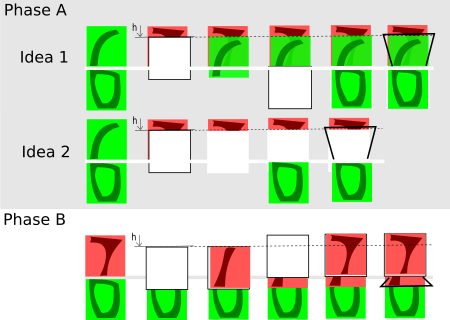

# Arduino FlipClock

This is a Arduino IDE project to run flip clock on a i2c monochrom OLED display with a atmega chip.

# Circuit

# Concept

I split a number into 2 bitmaps: upper and lower part. Both parts: 16x16 pixel.

I split a second into 40 parts (tick 0 - 39).

Tick 0 to 19: normal displaying upper and lower number part.

Tick 20 to 32:

I calculate a **h** variable to make 13 different flipping "images".

    oled->drawBitmap(x, y, zz1, 16, 16, WHITE);
    hideA(x,y,h);
    // oled->drawBitmap(x, y+h, zz0, 16, 16, WHITE);
    // hideA(x,y,16);
    oled->drawBitmap(x, y+j, zz0b, 16, 16, WHITE);
    
    oled->drawLine(x-1,    y+h-1, x+17, y+h-1,  WHITE);
    oled->drawLine(x-1,    y+h-1, x+2,  y+16, WHITE);
    oled->drawLine(x+17,   y+h-1, x+14, y+16, WHITE);
      
1.  place the upper part of the new number
2.  make a black hideA box. Start at y-position = h
3.  locks strange and is hidden: place the upper part of the actual number at y-position = h
4.  make a black hide box. Start at y+16 to hide (3.)
5.  place the lower part of the actual number
6.  print 3 lines to emulate a "number card"

Tick 33 to 39:

I calculate a **h** variable to make 7 different flipping "images". This is a bit faster
than the upper part of the flipping and makes the flipping more realistic.

    oled->drawBitmap(x, y+j, zz0b, 16, 16, WHITE);
    hideB(x,y,h);
    oled->drawBitmap(x, y+h, zz1b, 16, 16, WHITE);
    oled->fillRect(x, y, 16, 16, BLACK);
    oled->drawBitmap(x, y,   zz1, 16, 16, WHITE);
    
    oled->drawLine(x-1,    y+17+h, x+17, y+17+h,  WHITE);
    oled->drawLine(x+2,    y+17,   x-1,  y+17+h,  WHITE);
    oled->drawLine(x+14,   y+17,   x+16, y+17+h,  WHITE);
    
1.  place the lower part of the actual number
2.  make a black hideB box for the overlapping new number
3.  place the lower part of the new number at y-position = h
4.  make a black hide box. Start at y to hide (3.)
5.  place the upper part of the actual number
6.  print 3 lines to emulate a "number card"

# Picture & Video

