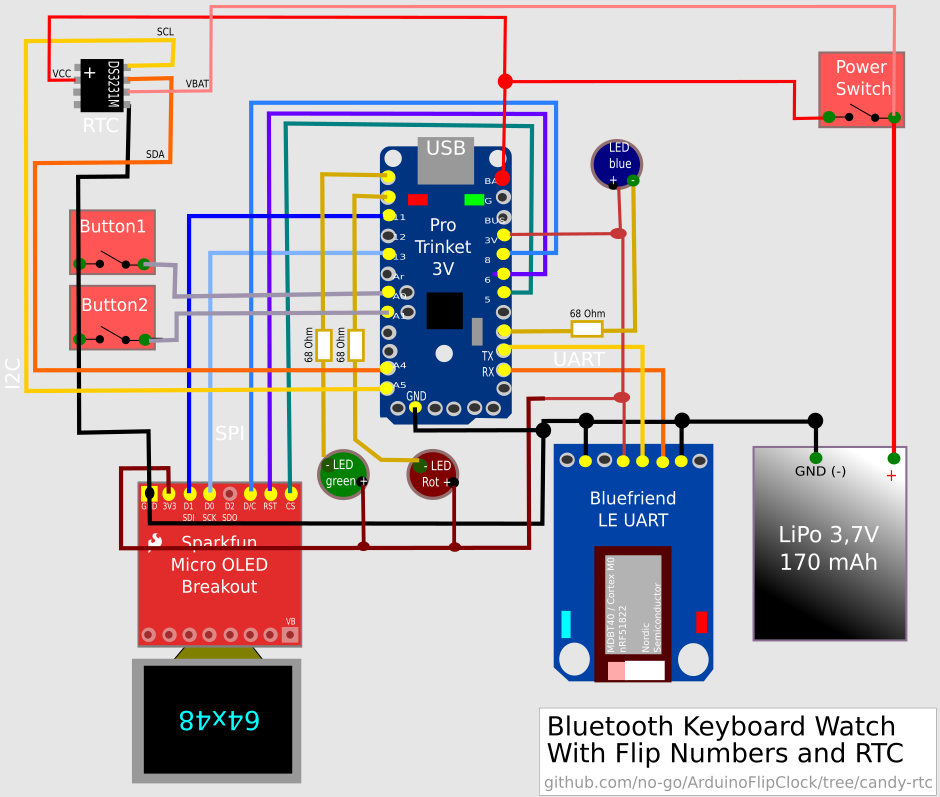
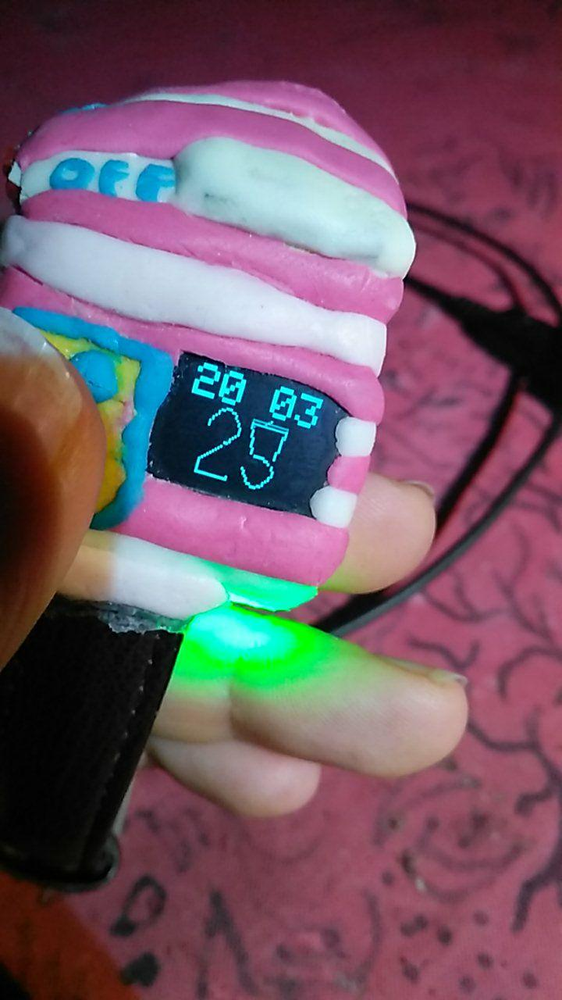

# Bluetooth Flip Watch (Candy)

This is a Arduino IDE project to run flip clock on a monochrom OLED display with a atmega chip. I add some
bluetooth features and a LED Lamp to the project.

# Features

- Big Clock (set hours+minutes)
- LED Lamp (different colors)
- flipping seconds
- use buttons as bluetooth keyboard (volume keys, cursor keys, media previous/next)

# Circuit

I add a Bluefruit UART nRF51 friend in this Branch and a RGB LED.

# Usage

## modes

If the Display is on you can use the watch as Bluetooth Keyboard. Button 1 and 2 has 6 modes:

### set clock

- set hours up, down
- set minutes up, down

### Bluetooth

- media prev or next
- volume up or down
- cursor up or down
- off

## if display is off

### Button 1

**short press** : Display on

### Button 2

**hold** : run through 6 different LED colors + Black. If color is black, display shows the
new mode !!

## if display is on

### Button 1

**short press** : hours or minutes up, *media prev*, *volume up* or *cursor up*

### Button 2

**short press** : hours or minutes down, *media next*, *volume down* or *cursor down*

# Picture

